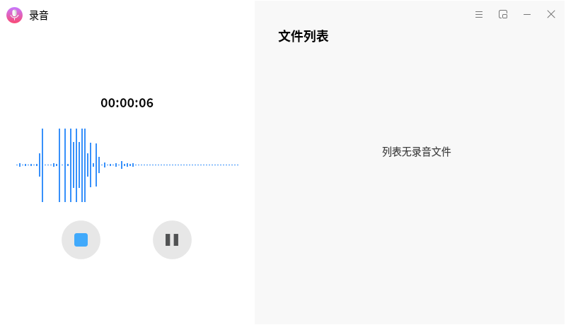
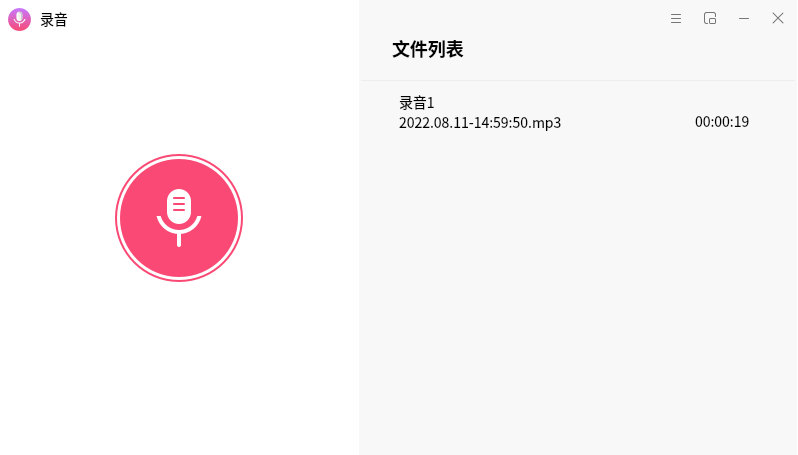
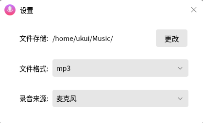

[English](../en_US/openEuler_UKUI_TEST.md) | 简体中文

# 小工具
## 麒麟录音
麒麟录音，是一款界面友好操作简单的录音工具，支持麦克风录制，多音频格式录制如mp3、wav等，支持文件列表播放、删除以及迷你模式等功能，多方位满足您的录音需求。主界面如图录音1所示。

测试过程如下：

1.点击录音按钮开始录音，实时生成波形图。

录音过程中，点击，暂停/继续录音；点击，即完成本次录音，默认存储路径为个人的音乐目录。

每次录音成功后，生成的音频文件会自动显示在文件列表中，并且可以在文件列表中播放和删除。

2.设置界面如图录音4所示，用户可自定义存储路径，选择录音文件格式。

3.点击可进入mini模式，点击“复原”按钮切回原界面。

 
 

