# UKUI3 框架介绍

## 一、UKUI整体介绍
&#160; &#160; &#160; &#160;UKUI(Ultimate Kylin User Interface) SIG小组致力于桌面环境相关软件包的规划、维护和升级工作，满足各种设备和用户需求的桌面环境程序，主要包含程序启动器（开始菜单）、用户配置、文件管理、登录锁屏、桌面、网络工具、快捷配置等，为用户提供基本的图形化操作平台。桌面核心组件开发工具以Qt、C++为主，宗旨是始终如一地提升系统的操作体验，提供集稳定性、美观性、流畅性和便捷性为一体的桌面环境。

**语言框架：**

&#160; &#160; &#160; &#160;主要使用Qt、GTK作为主要的开发环境，也使用了Qml和GIO、Glib等环境或开发库

**开源使用：**

&#160; &#160; &#160; &#160;窗口管理，主要使用KWin作为窗口管理器，使用Kwindowsystem开发库作为窗口开发工具,并通过Kwin等开源项目完成圆角特效、毛玻璃特效等功能
    ficix5-qt，使用ficix5框架完成麒麟输入法的框架搭建

**自研框架：**

&#160; &#160; &#160; &#160;UKUI整体遵循分层结构，主要分为环境服务层、UI框架层和核心组件层，UKUI功能为模块化分类逐级展开，可以支持实际需求裁剪不必要的模块或功能，也可以通过编译支持多种系统形态，例如PC、平板模式和大屏模式等

&#160; &#160; &#160; &#160;UKUI发展至今已有10个年头，最早主要仿照Unity桌面进行开发，发展过程中通过用户、产品、设计和开发者的不断碰撞下形成了UKUI独特的风格，因为UKUI与Windows在界面风格上很类似，这也减少了用户不必要的适应和学习成本，另一方面，因为UKUI流畅的体验和稳定性，已经被Fedora、Ubuntu、Debian、openSUSE、Ubuntu Kylin等全球十多个主流Linux发行版仓库收录，收到了许多国外用户的好评。

## 二、技术特性
&#160; &#160; &#160; &#160;资源共享

&#160; &#160; &#160; &#160;可定制化

&#160; &#160; &#160; &#160;高安全性

## 三、技术框架
&#160; &#160; &#160; &#160;UKUI整体遵循分层结构，主要分为环境服务层、UI框架层和核心组件层，UKUI功能为模块化分类逐级展开，可以支持实际需求裁剪不必要的模块或功能，也可以通过编译支持多种系统形态，例如PC、平板模式和大屏模式等，UKUI技术架构以及与操作系统的关系如下图所示。

 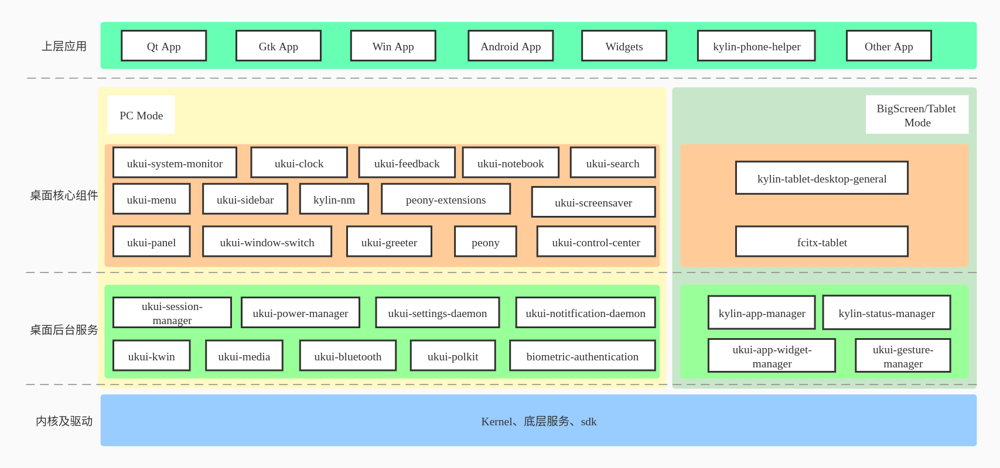

### 3.1 核心环境服务
&#160; &#160; &#160; &#160;核心环境服务是UKUI核心能力的一个集合，通过DBUS、GSettings、开发库或框架层对核心组件或应用层提供服务，该层主要包括以下几个服务：

#### 3.1.1 电源管理服务
&#160; &#160; &#160; &#160;电源管理服务为UKUI提供必要的电源管理策略，提供电池/电源工作模式切换功能、CPU/GPU调频、空闲信号处理、开合盖处理、亮度调节功能、电池信息管理等功能，为操作系统提供必要的电源/电池管理机制，平衡计算机尤其是笔记本、平板设备的机器性能和续航能力，电源管理服务框架如下图所示

 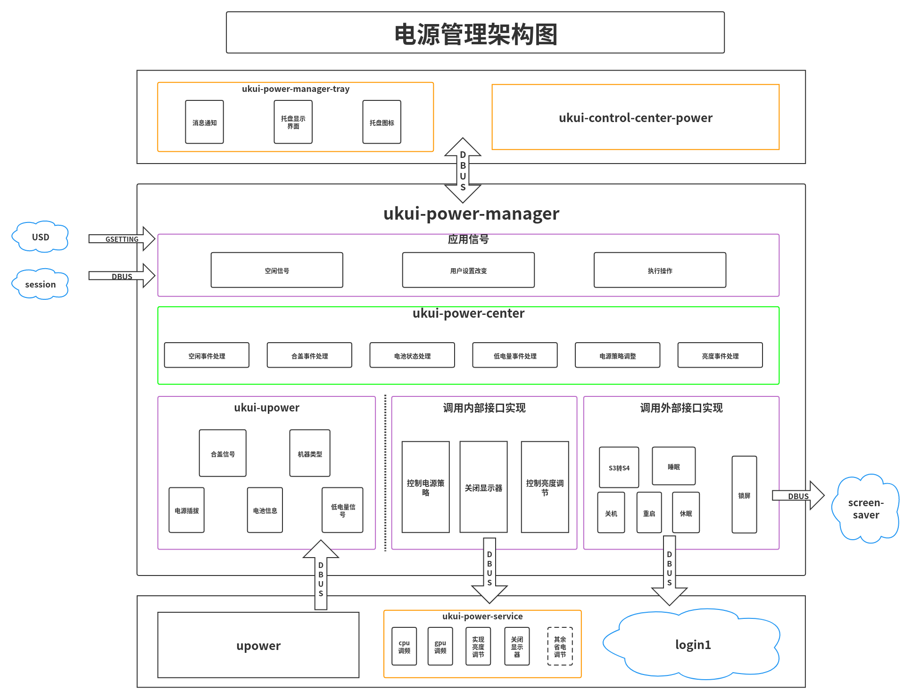

#### 3.1.2 搜索服务
&#160; &#160; &#160; &#160;在ukui桌面环境中的本地搜索服务以及其开发接口。基于文建索引服务，应用搜索数据服务等基础数据源服务，可以提供基于C++接口的搜索功能，应用开发者可以通过引用动态库的形式直接使用其搜索功能。除此之外，ukui桌面环境搜索服务还提供了一组基于Qt插件框架的插件接口，用户可以通过继承接口以实现搜索功能的扩展

 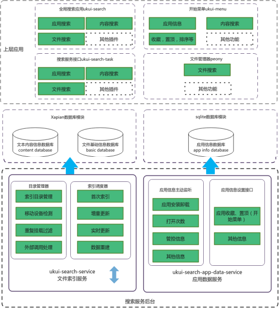

#### 3.1.3 用户配置服务
&#160; &#160; &#160; &#160;用户配置服务即ukui-settings-daemon 是UKUI桌面环境下的底层守护程序； 负责设置UKUI环境中各种参数以及运行的应用程序，主要有外设、显示、快捷键、色温、桌面模式管理等功能，具体框架如下图所示：

 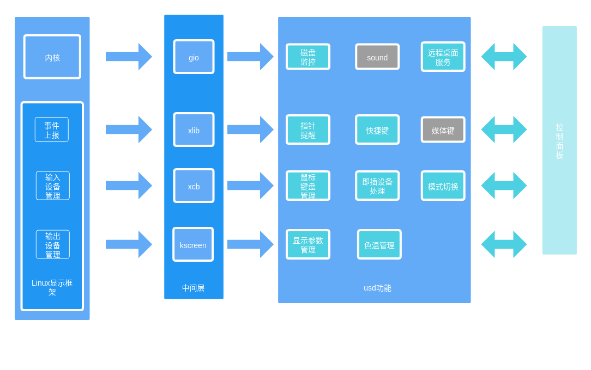

#### 3.1.4 应用管理服务- [ 待补充]
&#160; &#160; &#160; &#160; kylin-app-manager

#### 3.1.5 系统通知服务
&#160; &#160; &#160; &#160;消息通知中心是显示消息通知的组件，当有消息时会在屏幕右上角以弹窗形式展示消息内容和支持的操作，目前支持所有符合freedesktop notifications协议的消息。

 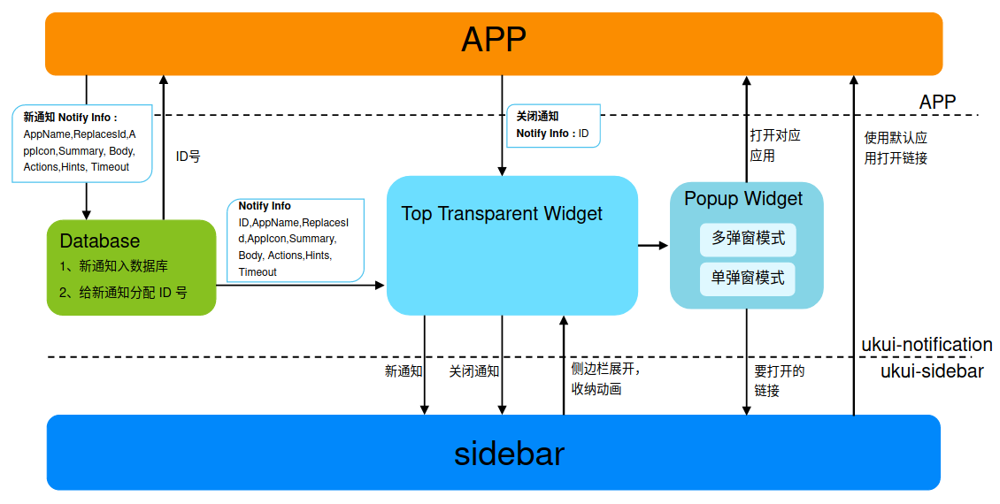

### 3.2 UI框架层
&#160; &#160; &#160; &#160;UI框架层主要为各核心组件或应用提供UI实现框架

#### 3.2.1 主题框架
&#160; &#160; &#160; &#160;主题框架是UKUI3.0设计稿出来之后提出的设想。仅凭当时的技术很难达到设计稿的设计效果和功能需求。主要解决UKUI和应用风格混乱，不同应用之间的外观差别太大，主要体现在自研应用和社区应用之间。
&#160; &#160; &#160; &#160;主要意义：
- 对开发者而言，为每个控件调样式是非常痛苦的，不利于应用的开发
- 对设计师而言，为控件设计样式要比设计应用简单，而且利于与开发人员沟通
- 相同的技术，影响的范围可能会不同，把掌握的技术用在主题中是最合理并且最高效的

#### 3.2.2 网络插件
&#160; &#160; &#160; &#160;网络插件分别提供了后端逻辑库以及前端界面插件，用于实现网络状态信息交互以及前端界面的显示。可以通过使用插件来实现桌面环境整体网络UI界面的统一性，也可以使用后端逻辑库来实现自定义的网络操作。目前登陆锁屏已经使用了相关内容。

 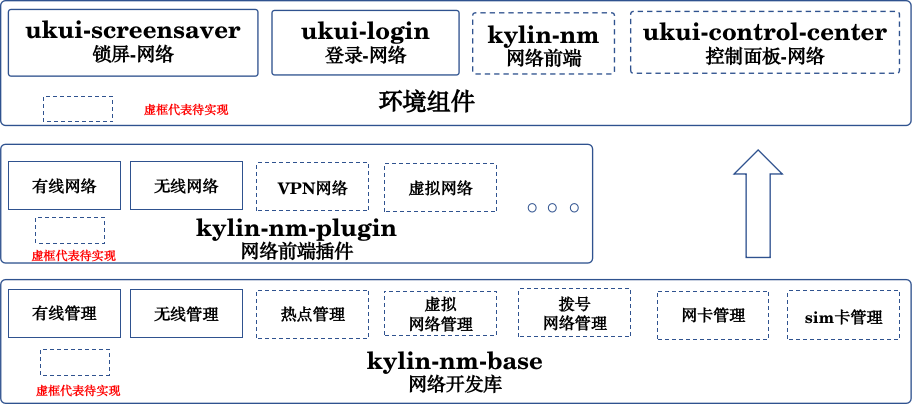

#### 3.2.3 搜索插件
&#160; &#160; &#160; &#160;全局搜索（ukui-search）提供了一组接口，用于实现全局搜索的各个搜索功能，通过继承并实现接口函数，可实现增加自定义的搜索功能，目前全局搜索中的文件，应用，设置项搜索功能均基于此接口开发。

 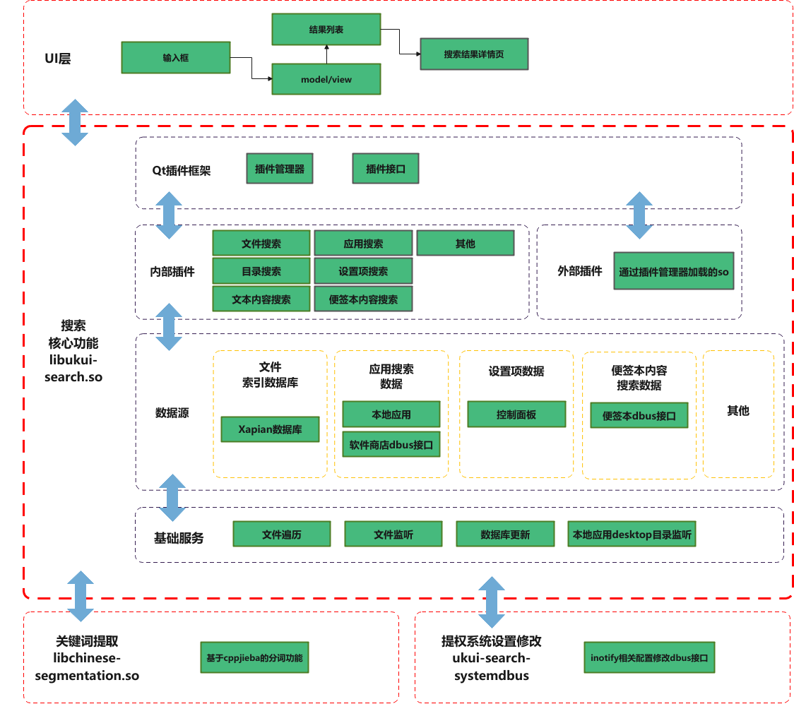

### 3.3 核心环境组件
#### 3.3.1 开始菜单
&#160; &#160; &#160; &#160;开始菜单提供应用打开功能，有默认窗口和全屏窗口两种应用展示方式，支持以字母分类、功能分类来分类显示应用，能够通过应用搜索快速检索应用并启动。同时提供应用卸载、电源、固定到任务栏、发送到桌面快捷方式、固定到收藏、最近修改文件显示等功能。

 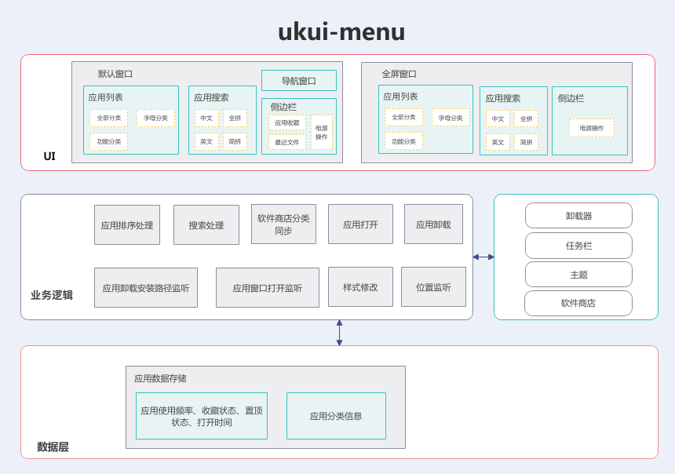

#### 3.3.2 任务栏

 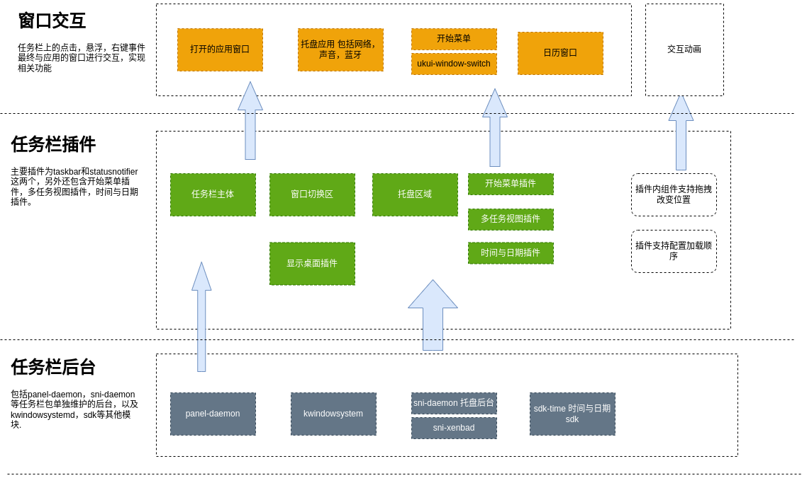

#### 3.3.3 侧边栏

 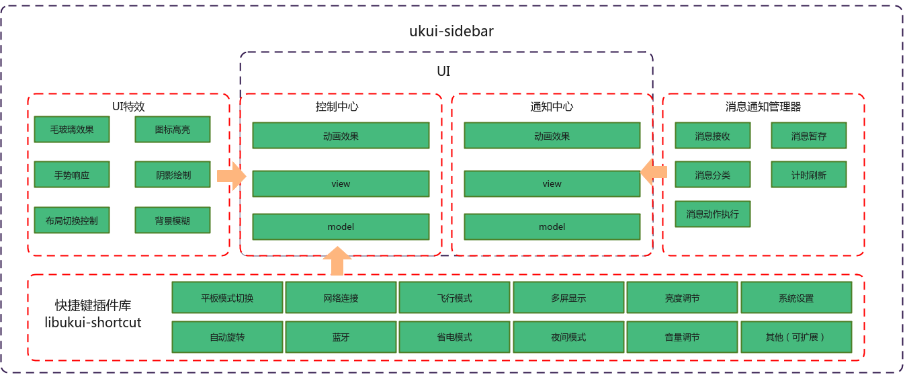

#### 3.3.4 文件管理器
&#160; &#160; &#160; &#160;文件管理器是以Qt为前端，GLib/GIO/GVfs为后端实现的为用户提供常用的文件操作功能，比如文件查看，文件复制、粘贴、剪切、删除、重复名，文件选用应用打开，文件搜索，文件排序，文件预览等，方便用户在界面上直观地管理系统文件的桌面组件。
Peony分为内部项目和外部插件项目两个部分，内部项目又可以分为peony，桌面，libpeony三个部分。文件管理器内部结构分为如下五层，底层数据与UI层交互采用的是Qt的model/view框架；考虑到使用qss的方式实现设计需求在统一性、迭代性以及后期维护成本等方面的弊端，文件管理器选择基于主题框架的开发模式进行UI层的开发；文件管理器为了实现功能的易维护和易扩展，实现了插件框架，在该框架下，开发者可以灵活地添加需要的插件，实现文件管理器功能持续的扩展，同时插件对于文件管理器本身是解耦的，文件管理器只提供基础的和必要的文件管理操作和界面功能。

 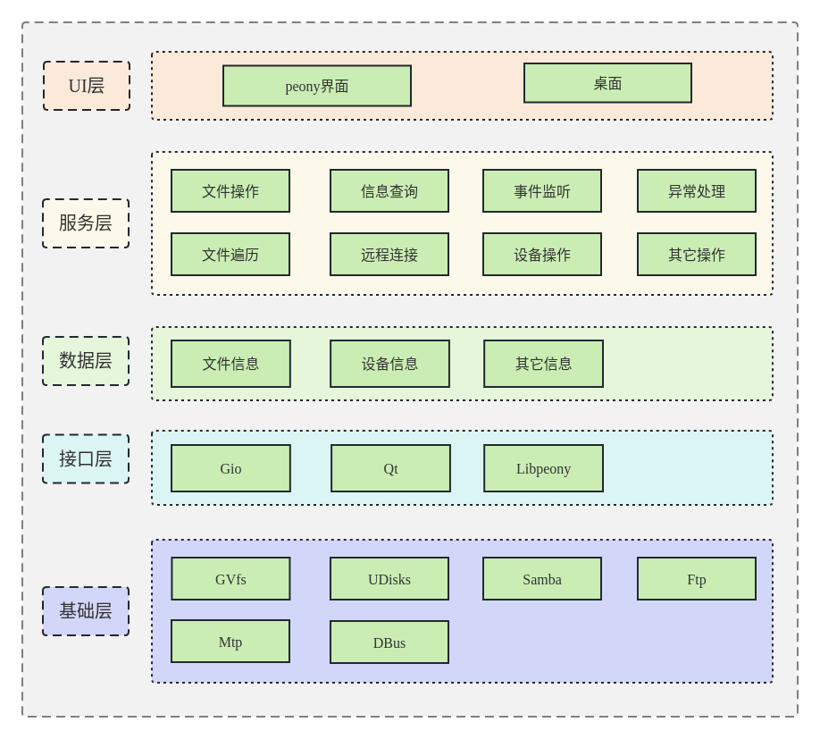

#### 3.3.5 会话管理器

 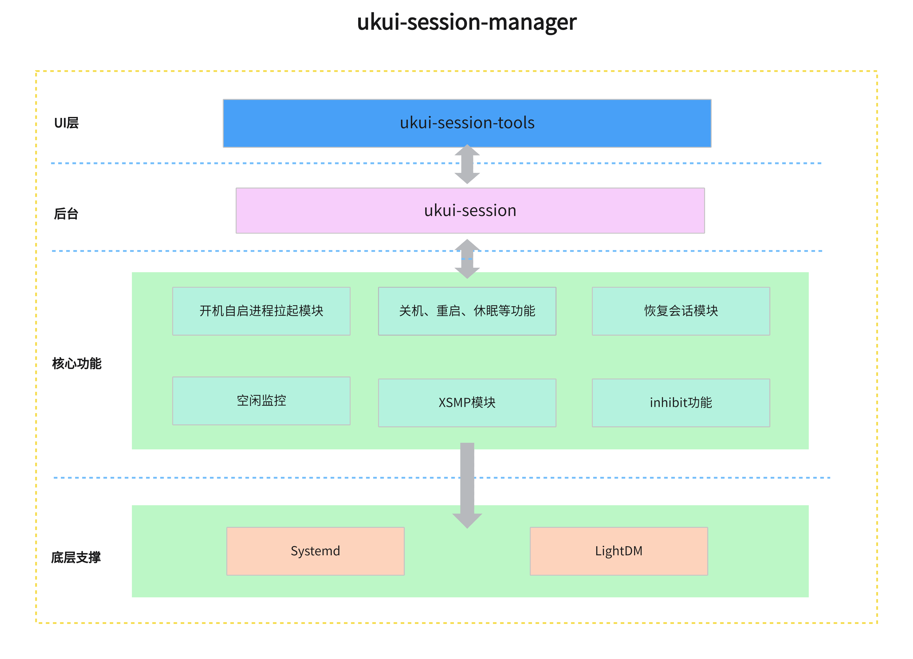

#### 3.3.6 登录锁屏

 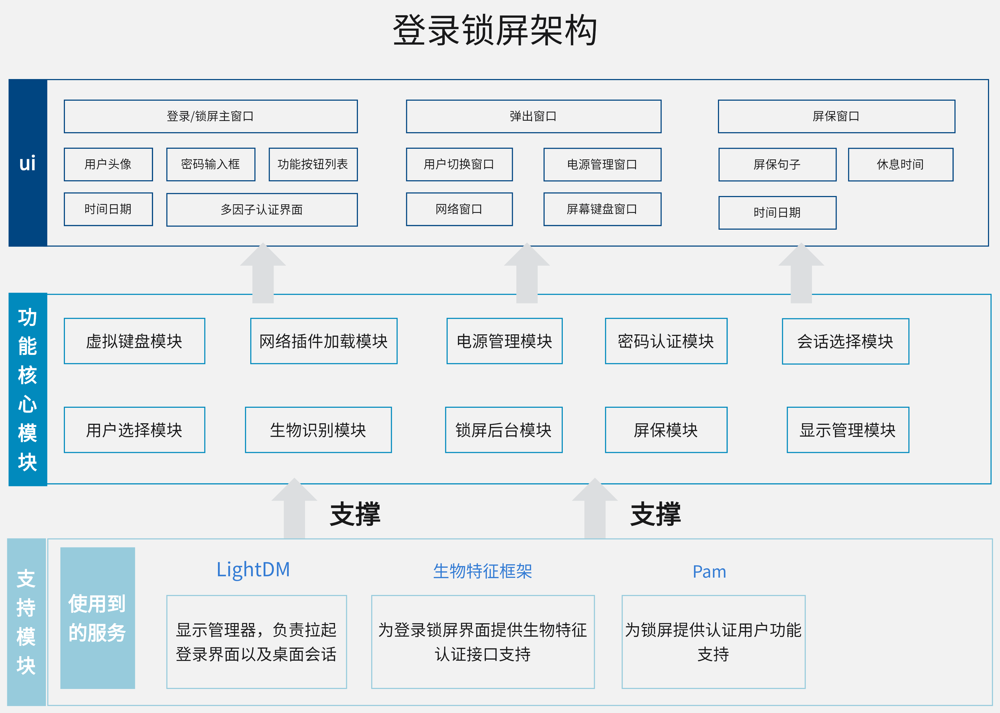

#### 3.3.7 控制面板

 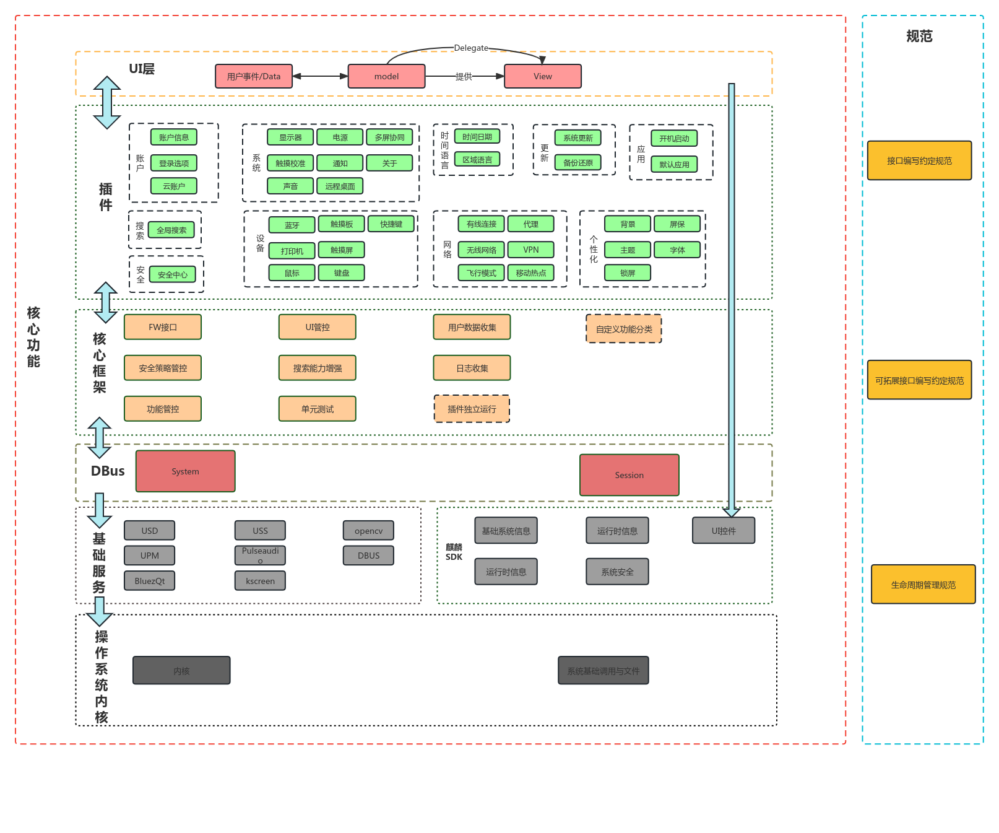

#### 3.3.8 多任务视图
&#160; &#160; &#160; &#160;多任务视图控制着虚拟桌面和预览窗口，通过多任务视图可以同时管理当前所有打开的窗口，以及创建出来的虚拟桌面。多任务视图提供了方便快捷的交互界面，可以使用户很方便的进行虚拟桌面的切换并找到想要的窗口，提高用户的生产效率和工作效率。
多任务视图实现了一个后台逻辑+多个前台 UI 的组合，目前支持了两套 PC 的 UI 和一套平板的 UI。多任务视图的实现是 C++ 和 QML 的结合，QML 负责构建复杂的 UI 界面， C++ 负责实现非界面的业务逻辑和复杂运算。很像“工厂模式”的思路，可以保证同一套后台适配不同的前台，可以在最小改动的前提下，满足不同的需求，更加容易扩展。并且因为qml自带许多属性，可以很好的实现动画，大大提升用户体验。

 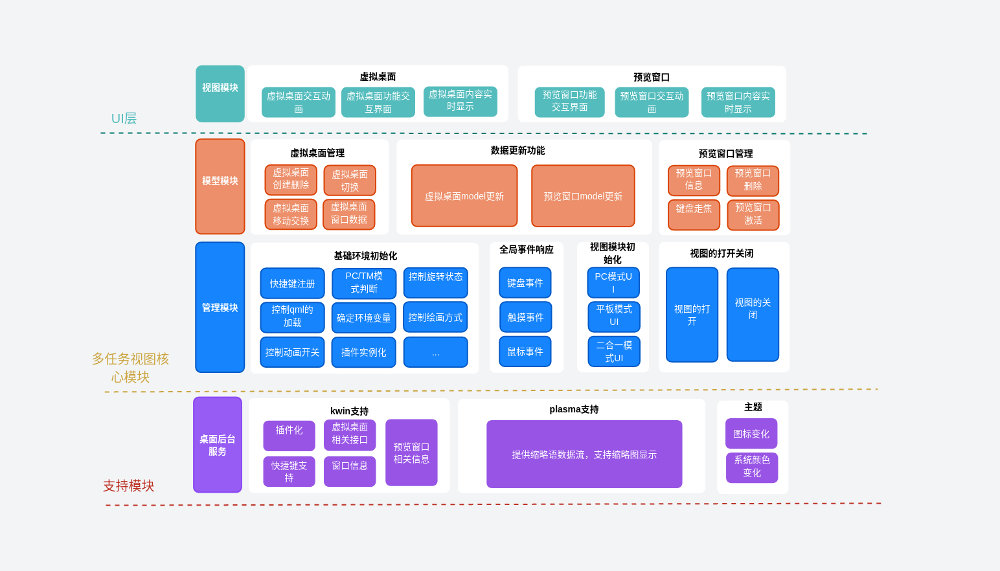

### 3.4 无线通信管理模块

#### 3.4.1 蓝牙

 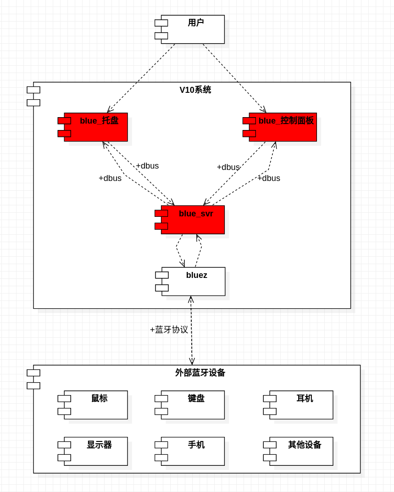

#### 3.4.2 网络

 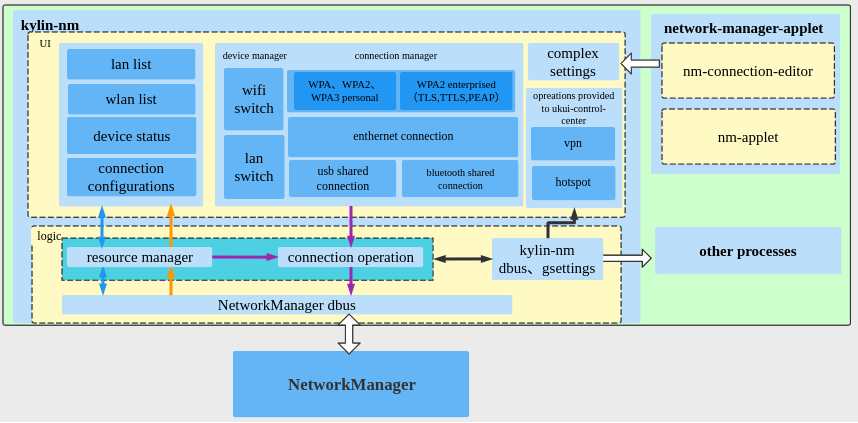

## 四、关键技术
&#160; &#160; &#160; &#160;主题框架
&#160; &#160; &#160; &#160;电源管理
&#160; &#160; &#160; &#160;应用管理
&#160; &#160; &#160; &#160;文件管理
&#160; &#160; &#160; &#160;生物认证管理
&#160; &#160; &#160; &#160;通知服务